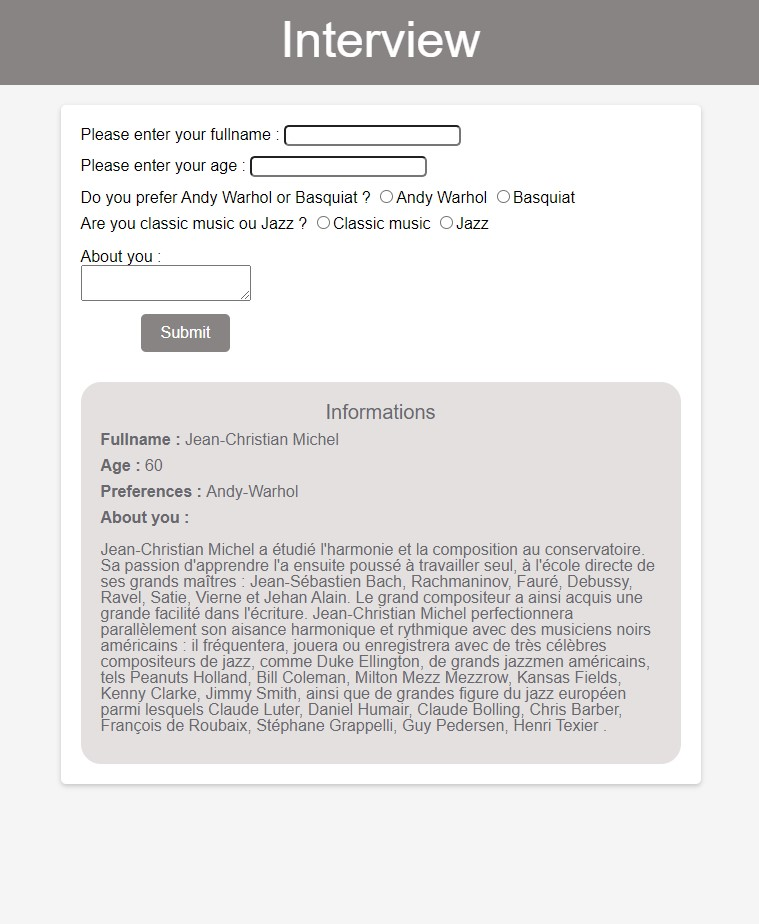

✨ Exercices PHP  ✨

> ## Hi ! I'm Delphine !
>
> #### This is exercises in Becode training.

 

## Making a form is to ask questions. Kind of like an interview.

##### Objective

> In order to propose a good UX and also to have good, valid data (e.g. that age is always written with numbers) we must be careful to use the right inputs.

> Whatever the input chosen, the attribute used to set the name of the variable that will be sent to the server is the attribute name, and the value will be specified in the attribute value (except for the textarea).

> When the form is submitted by the user, the form data is sent to the script specified in the action attribute

> On the server side, however, care must be taken not to expose the system to errors and hacking attempts.

> This is why the processing of an external input (for example via an html form) must always go through these steps, and in this order :

> * Sanitize

* Validate
* Execute
* Display (or redirect)

## 🔭 Project to be completed  (June 2023)

### References

[Filter_var](https://www.php.net/manual/en/filter.filters.sanitize.php)

[Input-radio](https://stackoverflow.com/questions/49966948/how-to-submit-form-with-multiple-groups-of-radio-buttons)

[Date](https://www.w3schools.com/php/func_date_date.asp)

[Class PHP](https://www.conseil-webmaster.com/formation/php/04-mise-en-forme-php.php)

------------

<h4 align="left">Connect with me:</h4>

<a href="<https://www.linkedin.com/in/delphine-lecorney/>" target="blank">" alt="Linkedin" height="30" width="40" /></a>

Delphine Lecorney
